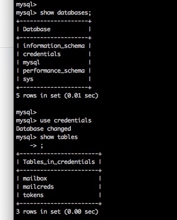
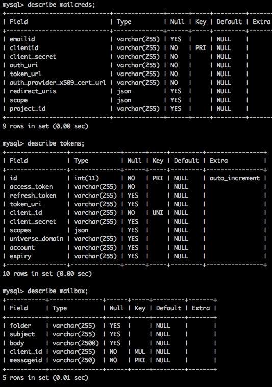
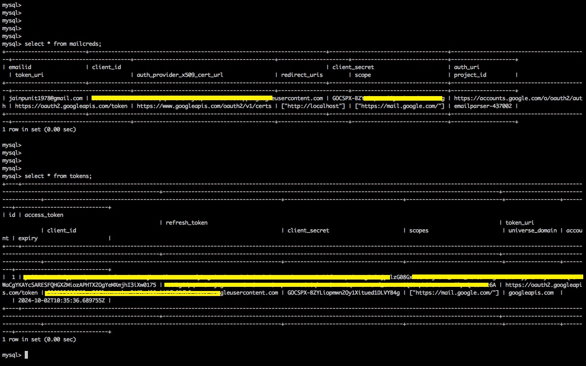

# Email Parser using Google OAUTH

This project is about authenticating with gmail using oauth. Once authorization is done it allows facility to read emails from INBOX and store them in mysql db if required.

## Table of Contents

- [Installation](#installation)
- [Pre-requisites for Usage](#Prerequisites)
- [Mysql DB Schema](#mysqlSchema)
- [Usage](#usage)
- [Limitations and Enhancements](#limitations)

## Installation

Instructions on how to install and set up the project.

```bash
# Example command
git clone https://github.com/username/repo.git
cd repo
pip install -r requirements.txt
```

## Pre-requisites for Usage

This assumes you have setup:
1. mysql with required configuration
2. have a google account
3. configured Google API client and Google OAuth libraries

## Mysql DB Schema

Below is db schema required for project setup:




Make sure mailcreds table is already populated with client_id, client_secret and other required details provided when you register for gmail oauth service.



As per below image make sure table mailcreds is already updated with required fields.
On running the script corresponding tokens db as well as mailbox db are updated.



1. **Credentials db**: 

## Usage

Once the pre-requisite are met, you can run script as below:

1. Set environmental variable. :
```bash
(emailparser) Punits-MacBook-Pro:emailparser punitjain$ export OAUTHPASS='your password for mysqldb'

```
2. Run the script with command below
```bash
(emailparser) Punits-MacBook-Pro:emailparser punitjain$ python emailActions.py --fetchMessages True --fetchnum=1 --username root --save 
regenerating token
please go to this url and authorize app https://accounts.google.com/o/oauth2/auth?response_type=code&client_id=fb3.apps.googleusercontent.com&redirect_uri=urn%3Aietf%3Awg%3Aoauth%3A2.0%3Aoob&scope=https%3A%2F%2Fmail.google.com%2F&state=3GiNUS9QhfgJWH18Z4y58&prompt=consent&access_type=offline
enter auth code here: <enter the code>
/Users/punitjain/Documents/Punit/project/emailparser/emailActions.py:112: DeprecationWarning: datetime.datetime.utcfromtimestamp() is deprecated and scheduled for removal in a future version. Use timezone-aware objects to represent datetimes in UTC: datetime.datetime.fromtimestamp(timestamp, datetime.UTC).
```

### Limitations and Enhancements

1. Still working on adding capabilities to read other folders apart from Inbox.
2. Adding proper exception handling in progress
3. Adding test cases